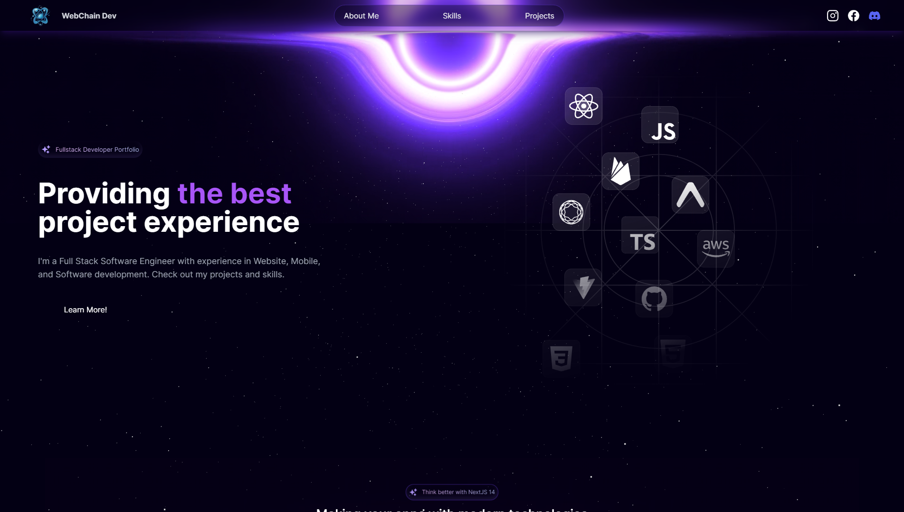

# Stellar Portfolio

    

<h4 align="center" >🚀 🟪 Stellar Portfolio 🟪 🚀</h4>

<h4 align="center">
  This application is a conclusion of my study about website perfomance, Real Time 3D Rendering and animations with NextJS
</h4>

#

  |&nbsp;&nbsp;
  <a style="color: #8a4af3;" href="#project">Overview</a>&nbsp;&nbsp;&nbsp;|&nbsp;&nbsp;&nbsp;
  <a style="color: #8a4af3;" href="#techs">Technologies</a>&nbsp;&nbsp;&nbsp;|&nbsp;&nbsp;&nbsp;
  <a style="color: #8a4af3;" href="#app">Project</a>&nbsp;&nbsp;&nbsp;|&nbsp;&nbsp;
  <a style="color: #8a4af3;" href="#run-project">Run</a>&nbsp;&nbsp;&nbsp;|&nbsp;&nbsp;
  <a style="color: #8a4af3;" href="#author">Author</a>&nbsp;&nbsp;&nbsp;|&nbsp;&nbsp;&nbsp;

#

<h1 align="center">
  
  

  

  

</h1>

 

 

<h2>  | :artificial_satellite: About:  </h2>

In this project, the target is to build a website that beats all the main factors and metrics that measure how fast and well-structured an application can be, along with amazing UI and improve all tech skills related to website animations, i use real time 3d Rendering to generate the effect of navigating in space.

For this, i build a Dev Portfolio website, that you can use as a template, because i can apply all features and visual designs and animations that i have in mind.

 

📡 | Hosted on Vercel: [ https://stellar-portfolio.vercel.app/ ]

 

<h2 id="techs">
  :building_construction: | Technologies and Concepts Studied:
</h2>

> 

- NextJS
- TailwindCSS
- Typescript
- Docker
- Three - [3D]
- Framer Motion
- react-icons
- eslint
- Prettier
- husky
- lint-staged
- Caching
- Perfomance
- SEO
- Scalability
- Web Vitals

> Among Others...

#

 
